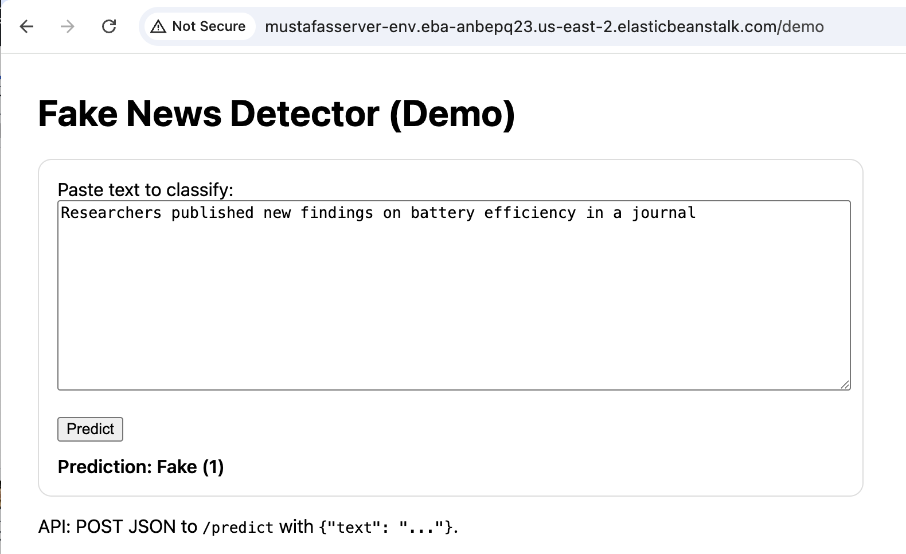

# Fake News Detection API – AWS Elastic Beanstalk Deployment

This repository contains a Machine Learning deployment where a Fake News Detection model is exposed as a Flask REST API and deployed on AWS Elastic Beanstalk. A demo web page (`/demo`) lets users classify text as **Real (0)** or **Fake (1)**, and an API endpoint (`/predict`) supports programmatic access.

---

## Table of Contents

1. [Project Overview](#project-overview)
2. [Model Description](#model-description)
3. [Application Architecture](#application-architecture)
4. [Deployment on AWS Elastic Beanstalk](#deployment-on-aws-elastic-beanstalk)
5. [API Endpoints](#api-endpoints)
6. [Web Demo UI](#web-demo-ui)
7. [Testing and Evaluation](#testing-and-evaluation)
8. [Latency Results and Boxplot](#latency-results-and-boxplot)
9. [Running the App Locally](#running-the-app-locally)
10. [Project Structure](#project-structure)
11. [Screenshots](#screenshots)

---

## Project Overview

The goal of this project is to implement and deploy a functional Fake News Detection API capable of classifying news text as real or fake. The API is backed by a trained ML model and served through Flask, deployed using AWS Elastic Beanstalk.

The main tasks completed in this project are:

- Trained a fake news classifier.
- Saved the trained model and vectorizer as `basic_classifier.pkl` and `count_vectorizer.pkl`.
- Implemented a Flask REST API in `application.py`.
- Created an HTML demo page at `/demo`.
- Deployed the application to AWS Elastic Beanstalk.
- Performed functional testing with several input examples.
- Performed latency testing with 4 test cases and 100 API calls per case.
- Generated a boxplot summarizing API latency.

---

## Model Description

The ML model consists of:

- **CountVectorizer** (bag-of-words text representation)
- **Logistic Regression classifier**

The model was trained on a dataset of labeled fake and real news articles. After training, the following artifacts were serialized using `pickle`:

- `basic_classifier.pkl` – the trained classifier.
- `count_vectorizer.pkl` – the fitted CountVectorizer.

At application startup, these pickled artifacts are loaded into memory and reused for all subsequent requests.

---

## Application Architecture

High-level flow:

```text
User → /demo (HTML form) → Flask API → Model → Prediction → HTML response

User → /predict (JSON)     → Flask API → Model → Prediction → JSON response
```

The model artifacts are located in the application directory when deployed on Elastic Beanstalk, e.g.

```text
/var/app/current/basic_classifier.pkl
/var/app/current/count_vectorizer.pkl
```

The Flask application exposes both a browser-based demo and a JSON API.

---

## Deployment on AWS Elastic Beanstalk

The app is deployed on AWS Elastic Beanstalk using the Python platform.

High-level deployment steps:

1. Create a new Elastic Beanstalk application and environment (Python platform).
2. Prepare a deployment bundle (ZIP file) containing:
   - `application.py`
   - `requirements.txt`
   - `basic_classifier.pkl`
   - `count_vectorizer.pkl`
   - `templates/demo.html`
   - `Procfile` (if required by the platform)
3. From the Elastic Beanstalk console, choose **Upload and deploy** and select the ZIP file.
4. Wait for the environment health to become **OK**.
5. Access the environment URL in a browser to verify that the app is running.

---

## API Endpoints

### 1. Health Check

```http
GET /
```

Returns a small JSON payload indicating that the application and model are loaded.

Example response:

```json
{
  "status": "ok",
  "model_loaded": true,
  "model_path": "/var/app/current/basic_classifier.pkl",
  "vectorizer_path": "/var/app/current/count_vectorizer.pkl"
}
```

---

### 2. Prediction API

```http
POST /predict
Content-Type: application/json
```

**Request body:**

```json
{
  "text": "Some news sentence to classify."
}
```

**Response body:**

```json
{
  "prediction": 0
}
```

Where:

- `0` = Real news
- `1` = Fake news

**Example cURL command:**

```bash
curl -s -X POST "http://<your-env>.elasticbeanstalk.com/predict" \
  -H "Content-Type: application/json" \
  -d '{"text": "The central bank kept interest rates unchanged this quarter."}'
```

---

## Web Demo UI

The demo page is served at:

```text
http://<your-env>.elasticbeanstalk.com/demo
```

The page contains:

- A textarea where the user can paste or type a news snippet.
- A **Predict** button that sends the text to the backend.
- A prediction label at the bottom showing `Real (0)` or `Fake (1)`.

See the screenshot in the [Screenshots](#screenshots) section.

---

## Testing and Evaluation

Two types of testing were performed:

### 1. Functional / Unit Testing

Four test inputs were created:

- Two examples that resemble fake news.
- Two examples that resemble real news.

Each input was manually tested via:

- The `/demo` web form, and
- Direct calls to the `/predict` JSON API.

This verified that the endpoint is reachable, the model is loaded correctly, and predictions are returned without errors.

### 2. Latency / Performance Testing

To evaluate performance, the four test cases above were used in a script that:

- Calls the `/predict` endpoint 100 times per test case (400 total requests).
- Measures the latency of each request using `time.perf_counter()`.
- Records an ISO timestamp and latency (in milliseconds) to a CSV file.

For each of the four test cases, there is a corresponding CSV file containing 100 rows.

---

## Latency Results and Boxplot

The latency measurements for the four test cases were visualized as a boxplot. Each box corresponds to one of the following cases:

- `fake_1`
- `fake_2`
- `real_1`
- `real_2`

Key observations:

- Median latency for all four cases is around 88–90 ms.
- The distributions are quite similar across cases.
- A few higher-latency outliers appear, which is expected due to network and server variability.

The boxplot image is shown below and is also saved in the repository.

```md

```

---

## Running the App Locally

You can also run the Flask application locally for development.

### 1. Install dependencies

```bash
pip install -r requirements.txt
```

### 2. Start the Flask server

```bash
python application.py
```

By default, the app will run on:

```text
http://127.0.0.1:5000
```

The demo page will be available at:

```text
http://127.0.0.1:5000/demo
```

---

## Project Structure

A possible project layout is shown below (actual layout may vary slightly):

```text
├── application.py
├── requirements.txt
├── basic_classifier.pkl
├── count_vectorizer.pkl
├── templates/
│   └── demo.html
├── results/
│   ├── fake_1.csv
│   ├── fake_2.csv
│   ├── real_1.csv
│   ├── real_2.csv
│   └── latency_boxplot.png
└── README.md
```

---

## Screenshots

### Demo Web Page

```md

```

### Latency Boxplot

```md

```

Place your actual screenshot files in a `screenshots/` folder (or update the paths above to match your repository). Once committed to GitHub, the images will render directly in this README.

