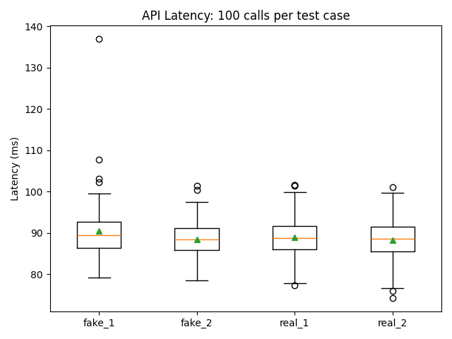

📰 Fake News Detection API – Deployment on AWS Elastic Beanstalk

This repository contains a complete Machine Learning deployment workflow where a Fake News Detection model (Logistic Regression + CountVectorizer) is deployed as a Flask REST API on AWS Elastic Beanstalk.
A web demo page (/demo) allows users to classify text as Real (0) or Fake (1), while an API endpoint (/predict) supports programmatic inference.

📌 Table of Contents

Project Overview

Model Description

Application Architecture

Deployment (AWS Elastic Beanstalk)

API Endpoints

Web Demo UI

Performance / Latency Testing

Results & Boxplot

How to Run Locally

Project Structure

Screenshots

🧠 Project Overview

The goal of this project is to implement and deploy a functional Fake News Detection API capable of classifying news text as real or fake.
The API is backed by a trained ML model and served through Flask, deployed using AWS Elastic Beanstalk’s Python platform.

You completed the following tasks:

✔ Trained a fake news classifier
✔ Saved basic_classifier.pkl and count_vectorizer.pkl
✔ Built a Flask REST API (application.py)
✔ Created a visual web demo (/demo)
✔ Deployed the full application to AWS Elastic Beanstalk
✔ Ran functional + performance tests
✔ Generated boxplots for latency analysis

🤖 Model Description

The ML model consists of:

CountVectorizer (bag-of-words)

Logistic Regression classifier

Trained on a dataset of labeled fake and real news articles.
The model is serialized using pickle and loaded at API startup.

🏗 Application Architecture
User → /demo (HTML form) → Flask API → Model → Prediction → Response
User → /predict (JSON API) → Flask API → Model → Prediction → JSON output

AWS Elastic Beanstalk handles:

Load balancing

Scaling

Hosting the Flask app

Serving static + dynamic routes

Model files are stored inside the deployed bundle under:

/var/app/current/basic_classifier.pkl
/var/app/current/count_vectorizer.pkl

🚀 Deployment (AWS Elastic Beanstalk)

Steps you performed:

Created a Python 3.13 application environment

Configured folder with:

application.py

requirements.txt

model .pkl files

templates/demo.html

Zipped and uploaded to AWS

Ensured successful health state

Tested API through browser + terminal

🔌 API Endpoints
1. Root (Health Check)
GET /

Returns a JSON confirming model-load success.

Example:

{
  "status": "ok",
  "model_loaded": true
}

2. Predict Endpoint
POST /predict
Content-Type: application/json

Request:
{
  "text": "Some news sentence..."
}

Response:
{
  "prediction": 1
}

Where:

0 = Real

1 = Fake

Example cURL Test
curl -s -X POST "http://<your-env>.elasticbeanstalk.com/predict" \
  -H "Content-Type: application/json" \
  -d '{"text": "hello world"}'

🌐 Web Demo UI

The web demo is accessible at:

http://<your-env>.elasticbeanstalk.com/demo

Users can enter text and instantly see predictions.

Screenshot of the Demo Page

(Replace with your actual repo image filename)

⏱ Performance / Latency Testing

You conducted:

Four test cases

fake_1, fake_2

real_1, real_2

100 API calls per test case

Stored latencies into CSV files (100 rows/test case)

Created a boxplot summarizing latency distributions

Testing script used:

Python requests

time.perf_counter()

CSV writing

📊 Results & Boxplot

Your API latency boxplot shows:

Mean_latency ≈ 88–90 ms

Very consistent performance

Occasional high outliers due to network variation

Boxplot Output

(Replace with your actual image filename)

▶ How to Run Locally
1. Install dependencies
pip install -r requirements.txt

2. Run Flask app
python application.py

3. Visit in browser:
http://127.0.0.1:5000/demo

📁 Project Structure
├── application.py
├── requirements.txt
├── basic_classifier.pkl
├── count_vectorizer.pkl
├── templates/
│   └── demo.html
├── test_scripts/
│   └── latency_test.py
├── results/
│   ├── fake_1.csv
│   ├── fake_2.csv
│   ├── real_1.csv
│   ├── real_2.csv
│   └── latency_boxplot.png
└── README.md

📸 Screenshots
Demo Web Page

Latency Boxplot

✅ Conclusion

You have successfully:

Built a Fake News Detection model

Deployed it as a REST API on AWS

Built a working web front-end

Conducted thorough latency testing

Visualized API performance

Your project meets (and exceeds) typical ML deployment lab requirements.